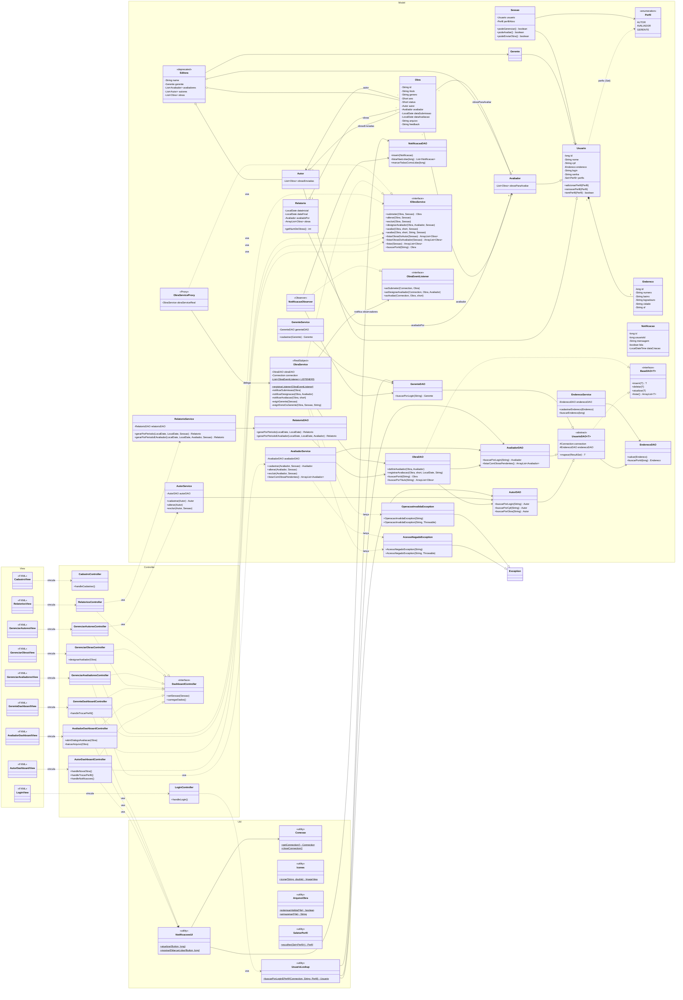

# Diagrama UML de classes — LibreFox (organizado por MVC)

```mermaid
classDiagram
    direction LR

    %% ===================================================================
    %% VIEW — src/main/resources/Views (FXML)
    %% ===================================================================
    namespace View {
        class LoginView { <<FXML>> }
        class CadastroView { <<FXML>> }
        class AutorDashboardView { <<FXML>> }
        class AvaliadorDashboardView { <<FXML>> }
        class GerenteDashboardView { <<FXML>> }
        class GerenciarAutoresView { <<FXML>> }
        class GerenciarAvaliadoresView { <<FXML>> }
        class GerenciarObrasView { <<FXML>> }
        class RelatoriosView { <<FXML>> }
    }

    %% ===================================================================
    %% CONTROLLER — br.edu.ufersa.LibreFox.Controller
    %% ===================================================================
    namespace Controller {
        class DashboardController {
            <<interface>>
            +setSessao(Sessao)
            +carregarDados()
        }
        class LoginController {
            +handleLogin()
        }
        class CadastroController {
            +handleCadastrar()
        }
        class AutorDashboardController {
            +handleNovaObra()
            +handleTrocarPerfil()
            +handleNotificacoes()
        }
        class AvaliadorDashboardController {
            +abrirDialogoAvaliacao(Obra)
            +baixarArquivo(Obra)
        }
        class GerenteDashboardController {
            +handleTrocarPerfil()
        }
        class GerenciarAutoresController
        class GerenciarAvaliadoresController
        class GerenciarObrasController {
            +designarAvaliador(Obra)
        }
        class RelatoriosController
    }

    %% ===================================================================
    %% MODEL — br.edu.ufersa.LibreFox.Model (entities + DAO + service)
    %% ===================================================================
    namespace Model {
        %% --- entities ---
        class Usuario {
            -long id
            -String nome
            -String cpf
            -Endereco endereco
            -String login
            -String senha
            -Set~Perfil~ perfis
            +adicionarPerfil(Perfil)
            +removerPerfil(Perfil)
            +temPerfil(Perfil) boolean
        }
        class Autor {
            -List~Obra~ obrasEnviadas
        }
        class Avaliador {
            -List~Obra~ obrasParaAvaliar
        }
        class Gerente
        class Perfil {
            <<enumeration>>
            AUTOR
            AVALIADOR
            GERENTE
        }
        class Endereco {
            -long id
            -String numero
            -String bairro
            -String logradouro
            -String cidade
            -String uf
        }
        class Obra {
            -String id
            -String titulo
            -String genero
            -Short ano
            -Short status
            -Autor autor
            -Avaliador avaliador
            -LocalDate dataSubmissao
            -LocalDate dataAvaliacao
            -String arquivo
            -String feedback
        }
        class Sessao {
            -Usuario usuario
            -Perfil perfilAtivo
            +podeGerenciar() boolean
            +podeAvaliar() boolean
            +podeEnviarObra() boolean
        }
        class Notificacao {
            -long id
            -long usuarioId
            -String mensagem
            -boolean lida
            -LocalDateTime dataCriacao
        }
        class Relatorio {
            -LocalDate dataInicial
            -LocalDate dataFinal
            -Avaliador avaliadoPor
            -ArrayList~Obra~ obras
            +getNumDeObras() int
        }
        class Editora {
            <<deprecated>>
            -String name
            -Gerente gerente
            -List~Avaliador~ avaliadores
            -List~Autor~ autores
            -List~Obra~ obras
        }

        %% --- DAO ---
        class BaseDAO~T~ {
            <<interface>>
            +inserir(T) T
            +deletar(T)
            +atualizar(T)
            +listar() ArrayList~T~
        }
        class UsuarioDAO~T~ {
            <<abstract>>
            #Connection connection
            #EnderecoDAO enderecoDAO
            +mapear(ResultSet) T*
        }
        class AutorDAO {
            +buscarPorLogin(String) Autor
            +buscarPorCpf(String) Autor
            +buscarPorObra(String) Autor
        }
        class AvaliadorDAO {
            +buscarPorLogin(String) Avaliador
            +listarComObrasPendentes() ArrayList~Avaliador~
        }
        class GerenteDAO {
            +buscarPorLogin(String) Gerente
        }
        class EnderecoDAO {
            +salvar(Endereco)
            +buscarPorId(long) Endereco
        }
        class ObraDAO {
            +definirAvaliador(Obra, Avaliador)
            +registrarAvaliacao(Obra, short, LocalDate, String)
            +buscarPorId(String) Obra
            +buscarPorTitulo(String) ArrayList~Obra~
        }
        class RelatorioDAO {
            +gerarPorPeriodo(LocalDate, LocalDate) Relatorio
            +gerarPorPeriodoEAvaliador(LocalDate, LocalDate, Avaliador) Relatorio
        }
        class NotificacaoDAO {
            +inserir(Notificacao)
            +listarNaoLidas(long) List~Notificacao~
            +marcarTodasComoLidas(long)
        }

        %% --- service (regra de negócio + Proxy + Observer) ---
        class IObraService {
            <<interface>>
            +submeter(Obra, Sessao) Obra
            +alterar(Obra, Sessao)
            +excluir(Obra, Sessao)
            +designarAvaliador(Obra, Avaliador, Sessao)
            +avaliar(Obra, short, Sessao)
            +avaliar(Obra, short, String, Sessao)
            +listarObrasDoAutor(Sessao) ArrayList~Obra~
            +listarObrasDoAvaliador(Sessao) ArrayList~Obra~
            +listar(Sessao) ArrayList~Obra~
            +buscarPorId(String) Obra
        }
        class ObraService {
            <<RealSubject>>
            -ObraDAO obraDAO
            -Connection connection
            -List~ObraEventListener~ LISTENERS$
            +registrarListener(ObraEventListener)$
            -notificarSubmissao(Obra)
            -notificarDesignacao(Obra, Avaliador)
            -notificarAvaliacao(Obra, short)
            -exigirGerente(Sessao)
            -exigirDonoOuGerente(Obra, Sessao, String)
        }
        class ObraServiceProxy {
            <<Proxy>>
            -ObraService obraServiceReal
        }
        class ObraEventListener {
            <<interface>>
            +aoSubmeter(Connection, Obra)
            +aoDesignarAvaliador(Connection, Obra, Avaliador)
            +aoAvaliar(Connection, Obra, short)
        }
        class NotificacaoObserver {
            <<Observer>>
        }
        class AutorService {
            -AutorDAO autorDAO
            +cadastrar(Autor) Autor
            +alterar(Autor)
            +excluir(Autor, Sessao)
        }
        class AvaliadorService {
            -AvaliadorDAO avaliadorDAO
            +cadastrar(Avaliador, Sessao) Avaliador
            +alterar(Avaliador, Sessao)
            +excluir(Avaliador, Sessao)
            +listarComObrasPendentes() ArrayList~Avaliador~
        }
        class GerenteService {
            -GerenteDAO gerenteDAO
            +cadastrar(Gerente) Gerente
        }
        class EnderecoService {
            -EnderecoDAO enderecoDAO
            +cadastrarEndereco(Endereco)
            +buscarEndereco(long)
        }
        class RelatorioService {
            -RelatorioDAO relatorioDAO
            +gerarPorPeriodo(LocalDate, LocalDate, Sessao) Relatorio
            +gerarPorPeriodoEAvaliador(LocalDate, LocalDate, Avaliador, Sessao) Relatorio
        }

        %% --- exceptions ---
        class AcessoNegadoException {
            +AcessoNegadoException(String)
            +AcessoNegadoException(String, Throwable)
        }
        class OperacaoInvalidaException {
            +OperacaoInvalidaException(String)
            +OperacaoInvalidaException(String, Throwable)
        }
    }

    %% ===================================================================
    %% UTIL — br.edu.ufersa.LibreFox.util (apoio transversal, fora do MVC)
    %% ===================================================================
    namespace Util {
        class Conexao {
            <<utility>>
            +getConnection()$ Connection
            +closeConnection()$
        }
        class Icones {
            <<utility>>
            +icone(String, double)$ ImageView
        }
        class ArquivoObra {
            <<utility>>
            +extensaoValida(File)$ boolean
            +armazenar(File)$ String
        }
        class SeletorPerfil {
            <<utility>>
            +escolher(Set~Perfil~)$ Perfil
        }
        class UsuarioLookup {
            <<utility>>
            +buscarPorLoginEPerfil(Connection, String, Perfil)$ Usuario
        }
        class NotificacoesUI {
            <<utility>>
            +atualizar(Button, long)$
            +mostrarEMarcarLidas(Button, long)$
        }
    }

    %% ===================================================================
    %% RELAÇÕES — View -> Controller -> Model -> (DAO -> banco)
    %% ===================================================================

    %% View liga-se ao seu Controller via fx:controller (atributo do FXML)
    LoginView ..> LoginController : vincula
    CadastroView ..> CadastroController : vincula
    AutorDashboardView ..> AutorDashboardController : vincula
    AvaliadorDashboardView ..> AvaliadorDashboardController : vincula
    GerenteDashboardView ..> GerenteDashboardController : vincula
    GerenciarAutoresView ..> GerenciarAutoresController : vincula
    GerenciarAvaliadoresView ..> GerenciarAvaliadoresController : vincula
    GerenciarObrasView ..> GerenciarObrasController : vincula
    RelatoriosView ..> RelatoriosController : vincula

    %% Controllers implementam o contrato comum de dashboard
    AutorDashboardController ..|> DashboardController
    AvaliadorDashboardController ..|> DashboardController
    GerenteDashboardController ..|> DashboardController
    GerenciarAutoresController ..|> DashboardController
    GerenciarAvaliadoresController ..|> DashboardController
    GerenciarObrasController ..|> DashboardController
    RelatoriosController ..|> DashboardController

    %% Controllers usam o Model (nunca o contrário)
    AutorDashboardController ..> IObraService : usa
    AvaliadorDashboardController ..> IObraService : usa
    GerenteDashboardController ..> IObraService : usa
    GerenciarObrasController ..> IObraService : usa
    GerenciarAutoresController ..> AutorService : usa
    GerenciarAvaliadoresController ..> AvaliadorService : usa
    RelatoriosController ..> RelatorioService : usa
    LoginController ..> UsuarioLookup : usa
    AutorDashboardController ..> NotificacoesUI : usa
    AvaliadorDashboardController ..> NotificacoesUI : usa
    GerenteDashboardController ..> NotificacoesUI : usa

    %% Dentro do Model: entidades
    Autor --|> Usuario
    Avaliador --|> Usuario
    Gerente --|> Usuario
    Usuario "1" *-- "1" Endereco
    Usuario ..> Perfil : perfis (Set)
    Sessao --> Usuario
    Sessao --> Perfil
    Obra "*" --> "1" Autor : autor
    Obra "*" --> "0..1" Avaliador : avaliador
    Autor "1" o-- "*" Obra : obrasEnviadas
    Avaliador "1" o-- "*" Obra : obrasParaAvaliar
    Relatorio "1" o-- "*" Obra : obras
    Relatorio --> Avaliador : avaliadoPor
    Editora --> Gerente
    Editora o-- Avaliador
    Editora o-- Autor
    Editora o-- Obra

    %% Dentro do Model: DAO
    UsuarioDAO ..|> BaseDAO
    AutorDAO --|> UsuarioDAO
    AvaliadorDAO --|> UsuarioDAO
    GerenteDAO --|> UsuarioDAO
    ObraDAO ..|> BaseDAO
    UsuarioDAO --> EnderecoDAO
    ObraDAO --> AutorDAO
    ObraDAO --> AvaliadorDAO
    RelatorioDAO --> ObraDAO

    %% Dentro do Model: service -> DAO, e os padrões Proxy/Observer
    ObraService ..|> IObraService
    ObraServiceProxy ..|> IObraService
    ObraServiceProxy --> ObraService : delega
    ObraService --> ObraDAO
    ObraService --> ObraEventListener : notifica observadores
    NotificacaoObserver ..|> ObraEventListener
    NotificacaoObserver --> NotificacaoDAO
    NotificacaoObserver --> GerenteDAO
    AutorService --> AutorDAO
    AvaliadorService --> AvaliadorDAO
    GerenteService --> GerenteDAO
    EnderecoService --> EnderecoDAO
    RelatorioService --> RelatorioDAO
    ObraService ..> AcessoNegadoException : lança
    ObraService ..> OperacaoInvalidaException : lança
    AvaliadorService ..> AcessoNegadoException : lança
    AcessoNegadoException --|> Exception
    OperacaoInvalidaException --|> Exception

    %% Util é usado por todas as camadas (View/Controller/Model), sem pertencer a nenhuma
    NotificacoesUI --> NotificacaoDAO
    NotificacoesUI --> Conexao
    UsuarioLookup --> AutorDAO
    UsuarioLookup --> AvaliadorDAO
    UsuarioLookup --> GerenteDAO
```

